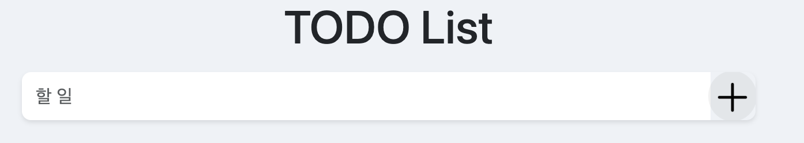

## 프로젝트 소개

사용자가 할 일을 입력하고 관리할 수 있는 기능 제공.

## 실행 방법

1. **To-Do 입력**: 할 일을 입력하고 추가 버튼을 누르면 아래에 리스트 항목 생성.
2. **완료 처리**: 리스트에서 각 할 일 항목 왼쪽의 체크박스를 클릭하여 완료된 항목 표시.
3. **수정 및 삭제** : 잘못 입력된 항목 수정 가능, 삭제 버튼을 통해 제거.
4. **저장 및 복원**: 사용자가 추가한 할 일 목록은 **localStorage**를 통해 저장됩니다. 앱을 새로고침하거나 재접속 시 할 일 목록이 자동으로 리스트에 표시.

## 팀원 정보

- **조태연** (PM): 프로젝트 전반 관리 및 진행 상황 조율
- **최시온** (디자이너): 애플리케이션의 전체적인 디자인을 담당.

## 기술 스택

- **HTML**: 웹 페이지 구조 구현.
- **CSS**: 스타일링 및 레이아웃을 관리.
- **JavaScript**: 할 일 추가, 삭제, 수정 및 체크 기능 구현

## 역할 분담

- **조태연** (PM): 프로젝트 관리 및 전체적인 방향성 설정, 기능 구현 (할 일 추가, 수정, 검색)
- **최시온** (디자이너): 디자인 구현 및 UI/UX 개선, 기능 구현 (삭제, 체크한 항목을 제일 밑으로 정렬, 표시)
